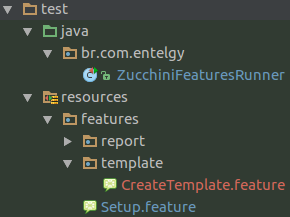

# Zucchini


Zucchini (zo͞oˈkēnē), a.k.a Abobrinha, é nossa ferramente de automação de testes baseada em [Cucumber](https://cucumber.io/) com diversos steps predefinidos.

[Lista completa com os Steps predefinidos](Steps.md)

## Instalação

```xml
<dependency>
    <groupId>br.com.entelgy</groupId>
    <artifactId>zucchini</artifactId>
    <version>1.1.1</version>
    <scope>test</scope>
</dependency>

```

## Configuração

Os testes com Zucchini devem seguir padrões dos testes com Cucumber.

Vejemos abaixo alguns itens necessários:

```java
@RunWith(Cucumber.class)
@CucumberOptions(
	format = {
		"pretty",
		"html:target/cucumber-reports/html"
	},
	monochrome = false,
	features = { "src/test/resources/features/" },
	glue = { "br.com.entelgy" },
	tags = { "@setup,@it" }
)
public class ZucchiniFeaturesRunner {

    private static WebDriver driver;

	@BeforeClass
	public static void setup() {
		driver = SeleniumDriver.getDriver(DriverEnum.CHROME);
	}

	@AfterClass
	public static void cleanup() {
		driver.quit();
	}
}
```

- A classe `ZucchiniFeaturesRunner` faz as configurações e execução de todos os cenários de testes.

- `@RunWith(Cucumber.class)` informa que os testes seram baseados no Framework Cucumber como executador.

- `@CucumberOptions` informa o diretório onde estaram os arquivos `.fearure` contendo os cenários de 
testes e as `tags` que iram ser executadas na bateria de testes. 

- Anote todos as `.features` com `@it`

- Anote o arquivo `Setup.feature` com `@setup`

- `@BeforeClass` e `@AfterClass` faram o controle de abertura e fechamento do WebDriver.

- `SeleniumDriver.getDriver(DriverEnum.CHROME);` inicializa o driver com o Google Chrome.

Drivers disponíveis ate o momento:

+ SeleniumDriver.getDriver(DriverEnum.CHROME)
+ SeleniumDriver.getDriver(DriverEnum.FIREFOX);
+ SeleniumDriver.getDriver(DriverEnum.PHANTOMJS);

Pode ocorrer de seu navegador não estar comparivem com a versão do webDriver, por isso, pode ser necessário informar o caminho seguindo o padrão:

```java
driver = SeleniumDriver.getInstance(DriverEnum.CHROME, "/path/to/your/chromedriver");
```

Como o Cucumber não garante a ordem de execução dos testes, siga a seguinte convenção:




### Setup.feature

Esta feature irá definir o acesso inicial dos testes, fazendo com que os demais testes não precisem acessar novamente.

```cucumber
# language: en
Feature: Setup
    
  @setup
  Scenario: Setup
    Given setup url "http://localhost:8080/"
```

### Exemplo

```cucumber
#language: en
@it @manual
Feature: Create Report
  First, we need to create a new Template and choose it on Portlet Preferences.
  
Scenario: Create a new report without clauses
  Given user "test@liferay.com" is logged in liferay
    Then I navigate to "web/guest/home"
	Then element having id "filter-report-name" should be present
    When I click on link having text "New"
    Then I enter "New Report" into input field having xpath "//*[contains(@id, '_report-name')]"
    When I click on element having id "report-save"
    Then element having class "notification--success" should have text as "Report successfully saved"
	Then logout in liferay
```
